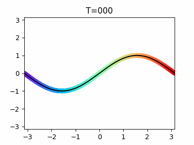

## What are Diffusion Models?
Diffusion models are type of deep generative models which consist of forward and reverse processes.

### Forward process
We add small gaussian noise to the input data step by step and make an isotropic Gaussian distribution. We train a model that converts to the gaussian distribution at any t step in the training phase.
|  | 
|:---:|
|Example of the forward process|

### Reverse process
We recreate the true sample from a gaussian noise in the prediction phase. It is the reverse of the forward process.
|  | 
|:---:|
|Example of the reverse process|

Please refer to the document below for detailed descriptions for the diffusion models.

## Table of contents
1. [Expectation and Variance](https://github.com/phykn/diffusion_models_tutorial/blob/main/00_theory/01_expectation_and_variance.ipynb)
1. [Reparameterization](https://github.com/phykn/diffusion_models_tutorial/blob/main/00_theory/02_reparameterization.ipynb)
1. [KL Divergence](https://github.com/phykn/diffusion_models_tutorial/blob/main/00_theory/03_kl_divergence.ipynb)
1. [Evidence lower bound (ELBO)](https://github.com/phykn/diffusion_models_tutorial/blob/main/00_theory/04_elbo.ipynb)
1. [Forward and Reverse process](https://github.com/phykn/diffusion_models_tutorial/blob/main/00_theory/05_forward_and_reverse.ipynb)

## References
1. [Expected value](https://en.wikipedia.org/wiki/Expected_value) (Wikipedia)
1. [Variance](https://en.wikipedia.org/wiki/Variance) (Wikipedia)
1. [Jensen's inequality](https://en.wikipedia.org/wiki/Jensen%27s_inequality) (Wikipedia)
1. [Kullback–Leibler divergence](https://en.wikipedia.org/wiki/Kullback%E2%80%93Leibler_divergence) (Wikipedia)
1. [Bayes' theorem](https://en.wikipedia.org/wiki/Bayes%27_theorem) (Wikipedia)
1. [공돌이의 수학정리노트](https://angeloyeo.github.io)
1. [Matthew N. Bernstein](https://mbernste.github.io)
1. [Generative Modeling by Estimating Gradients of the Data Distribution](https://yang-song.net/blog/2021/score) (Yang Song, 2021)
1. [What are Diffusion Models?](https://lilianweng.github.io/posts/2021-07-11-diffusion-models) (Lilian Weng, 2021)
1. [Diffusion models explained. How does OpenAI's GLIDE work?](https://youtu.be/344w5h24-h8) (
AI Coffee Break with Letitia, 2022)
1. [How does Stable Diffusion work? – Latent Diffusion Models EXPLAINED](https://youtu.be/J87hffSMB60) (
AI Coffee Break with Letitia, 2022)
1. [Diffusion Models | Paper Explanation | Math Explained](https://youtu.be/HoKDTa5jHvg) (Outlier, 2022)
1. [DDPM - Diffusion Models Beat GANs on Image Synthesis (Machine Learning Research Paper Explained)](https://youtu.be/W-O7AZNzbzQ) (Yannic Kilcher, 2021)
1. [Diffusion models from scratch in PyTorch](https://youtu.be/a4Yfz2FxXiY) (DeepFindr, 2022)
1. [Denoising Diffusion Probabilistic Models](https://arxiv.org/abs/2006.11239) (Jonathan Ho, Ajay Jain, Pieter Abbeel, 2020)
1. [Diffusion Models: A Comprehensive Survey of Methods and Applications](https://arxiv.org/abs/2209.00796) (Ling Yang, et al., 2022)
1. [Diffusion Models in Vision: A Survey](https://arxiv.org/abs/2209.04747) (Florinel-Alin Croitoru, et al., 2022)
