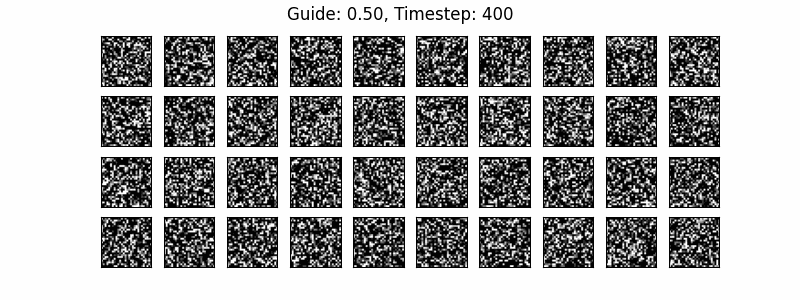
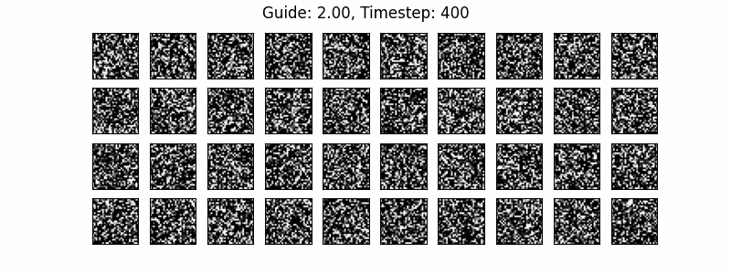

## MNIST Example for Diffusion models
This repository is an example of a small diffusion models for MNIST dataset. It uses a small U-Net architecture. Most codes are just copy and paste from [1]. I made a small correction in the original code for convenience.

## Train model
```python
python train.py
```

## Inference
```python
ddpm = DDPM(n_T=400, ...)   # n_T is the number of timesteps

x, x_store = ddpm.sample(
  n_sample=10,              # number of samples
  size=(1, 28, 28),         # image shape
  n_classes=10,             # number of classes
  guide_w=0.0               # guide weight
)

print(x.shape)
>>> (10, 1, 28, 28)

print(x_store.shape)
>>> (400, 10, 1, 28, 28)
```

## Visualization
<figure></figure>
<figure></figure>
<figure></figure>

## References
1. https://github.com/TeaPearce/Conditional_Diffusion_MNIST
2. https://github.com/cloneofsimo/minDiffusion
3. [Denoising Diffusion Probabilistic Models](https://arxiv.org/abs/2006.11239), Jonathan Ho, Ajay Jain, Pieter Abbeel, 2020
4. [Classifier-Free Diffusion Guidance](https://arxiv.org/abs/2207.12598), Jonathan Ho, Tim Salimans, 2022
5. [Photorealistic Text-to-Image Diffusion Models with Deep Language Understanding](https://arxiv.org/abs/2205.11487), Chitwan Saharia, et al., 2022
